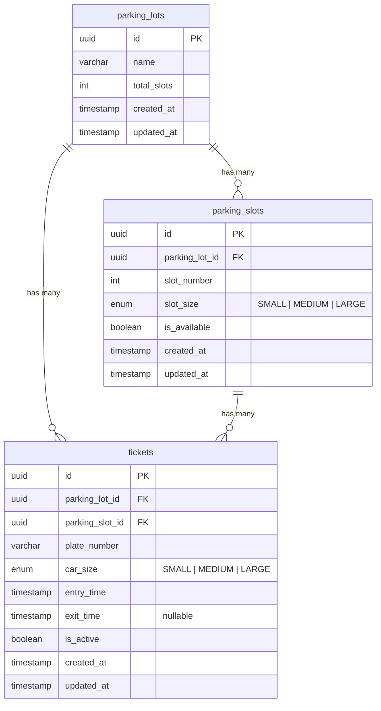
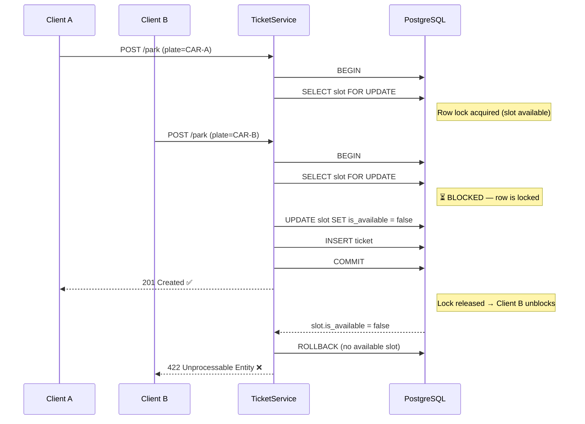

# Parking Lot API

A production-quality REST API for managing parking lots, assigning slots, and tracking vehicle tickets — built with NestJS, TypeScript, and PostgreSQL.

## Table of Contents

- [Quick Start](#quick-start)
- [Tech Stack](#tech-stack)
- [API Reference](#api-reference)
- [Assumptions & Design Decisions](#assumptions--design-decisions)
- [ER Diagram](#er-diagram)
- [Concurrency: Pessimistic Locking](#concurrency-pessimistic-locking)
- [Running Tests](#running-tests)
- [Response Envelope](#response-envelope)
- [Example Walkthrough](#example-walkthrough)

---

## Quick Start

### Prerequisites

- Docker + Docker Compose

### Run with Docker

```bash
docker compose up --build
```

| Service | URL |
|---|---|
| API | `http://localhost:3000` |
| Swagger UI | `http://localhost:3000/api` |

Re-running `docker compose up --build` is safe — PostgreSQL data is persisted in a named volume and TypeORM `synchronize` is idempotent.

### Run without Docker

Requires Node.js 20+ and a local PostgreSQL instance.

```bash
cp .env.example .env   # fill in DB credentials
npm install
npm run start:dev
```

### Environment Variables

| Variable | Default | Description |
|---|---|---|
| `PORT` | `3000` | HTTP port |
| `NODE_ENV` | `development` | Controls logging and TypeORM synchronize |
| `DB_HOST` | `localhost` | PostgreSQL host |
| `DB_PORT` | `5432` | PostgreSQL port |
| `DB_USERNAME` | `postgres` | Database user |
| `DB_PASSWORD` | `postgres` | Database password |
| `DB_DATABASE` | `parking_lot_db` | Database name |

---

## Tech Stack

| Layer | Choice |
|---|---|
| Framework | NestJS 11 (TypeScript strict mode) |
| Database | PostgreSQL 15 via TypeORM 0.3 |
| Containerisation | Docker (multi-stage build) + Docker Compose |
| Validation | class-validator + class-transformer |
| API Docs | Swagger UI (`/api`) |
| Unit Tests | Jest v30 — 47 tests, >80% coverage |
| E2E Tests | Jest + Supertest + pg-mem in-memory PostgreSQL (15 tests) |
| Concurrency Test | Jest + Supertest against real PostgreSQL (1 test) |

---

## API Reference

### Parking Lots

| Method | Endpoint | Description |
|---|---|---|
| `POST` | `/parking-lots` | Create a parking lot with sized slot groups |
| `GET` | `/parking-lots/:id/status?limit=&offset=` | Slot map with pagination and occupant per slot |
| `GET` | `/parking-lots/:id/cars?size=` | Plate numbers of parked cars filtered by car size |
| `GET` | `/parking-lots/:id/slots?size=` | Slot numbers occupied by a given car size |

### Tickets

| Method | Endpoint | Description |
|---|---|---|
| `POST` | `/parking-lots/:id/park` | Park a car — returns a ticket |
| `POST` | `/parking-lots/:id/leave/:ticketId` | Release a slot — returns duration parked |

Full interactive documentation (request/response schemas, try-it-out) is available at **`/api`** when the app is running.

---

## Assumptions & Design Decisions

The problem statement leaves several design choices open. Below are the assumptions made and the reasoning behind each.

### 1. Linear lot layout

A single-entrance lot maps naturally to a linear numbered-slot model — no grid or radius calculation needed.

```
   Entry / Exit
       ↓
┌──────┬──────┬──────┬─────┬──────┐
│ S1   │ S2   │ S3   │ ... │ SN   │
│LARGE │LARGE │MEDIUM│     │SMALL │
└──────┴──────┴──────┴─────┴──────┘
```

### 2. Slots have a physical size

The spec mentions cars have a size but is silent on slots. Giving slots a physical size adds realistic constraints:

| Slot Size | Accepts |
|---|---|
| `LARGE` | LARGE, MEDIUM, SMALL |
| `MEDIUM` | MEDIUM, SMALL |
| `SMALL` | SMALL only |

Smaller cars can use larger slots when no matching slot is free, maximising utilisation.

### 3. Slot numbering: LARGE → MEDIUM → SMALL

Slots are numbered LARGE-first at creation time. The lowest-numbered slots can accommodate the widest range of car sizes, so large slots are never "trapped" behind small ones.

### 4. Nearest-available-first assignment

`parkCar()` always picks the **lowest-numbered compatible slot** — deterministic and fair.

### 5. Uppercase normalisation

All `carSize` / `slotSize` values are `SMALL | MEDIUM | LARGE`. Plate numbers are normalised to uppercase on entry (`abc-1234` → `ABC-1234`).

### 6. One car, one active ticket globally

A plate number can only have **one active ticket** across all parking lots. This reflects the physical constraint that a car can only be in one place at a time.

### 7. Pessimistic write lock for concurrency

`parkCar()` wraps slot selection and reservation in a single transaction with `pessimistic_write` (`SELECT … FOR UPDATE`). Under concurrent requests, only one transaction acquires the lock; the rest block until it commits, then see `is_available = false`. See [Concurrency: Pessimistic Locking](#concurrency-pessimistic-locking) for details.

---

## ER Diagram

Three entities: `ParkingLot` owns many `ParkingSlot`s. A `Ticket` records one car's stay in one slot.



**Key constraint:** `is_available` on `parking_slots` is the single source of truth for slot occupancy. It is toggled inside a pessimistic-write transaction to prevent double-booking.

**Indexes:**

| Table | Columns | Purpose |
|---|---|---|
| `parking_slots` | `(parking_lot_id, is_available, slot_size, slot_number)` | Fast nearest-slot lookup for `parkCar()` |
| `tickets` | `(parking_lot_id, is_active)` | Lot-scoped active ticket queries |
| `tickets` | `(parking_slot_id, is_active)` | Paginated status with per-slot ticket lookup |
| `tickets` | `(plate_number, is_active)` | Duplicate-plate check on park |

---

## Concurrency: Pessimistic Locking

When two cars attempt to park simultaneously in a lot with one slot remaining, `SELECT … FOR UPDATE` ensures only one succeeds.



**Result:** Only Client A parks. Client B receives `422 Unprocessable Entity — No available slot`.

This behaviour is verified by the concurrency stress test (`npm run test:concurrency`), which fires **10 simultaneous requests** at a 1-slot lot and asserts exactly **1 success** and **9 failures**.

---

## Running Tests

```bash
# Unit tests (47 tests, no database required)
npm test

# E2E tests (15 tests, no database required — uses pg-mem in-memory PostgreSQL)
npm run test:e2e

# Concurrency stress test (requires Docker DB to be running)
docker compose up -d postgres
npm run test:concurrency

# Coverage report
npm run test:cov
```

> **Note:** The concurrency test is safe to re-run without restarting Docker. Each run creates a new parking lot via the API, so there is no leftover state.

---

## Response Envelope

Every response is wrapped by a global interceptor and exception filter.

**Success (`2xx`):**
```json
{
  "data": { "...": "..." },
  "timestamp": "2026-04-04T08:00:00.000Z",
  "path": "/parking-lots"
}
```

**Error (`4xx` / `5xx`):**
```json
{
  "statusCode": 404,
  "message": "Parking lot with id \"abc\" not found.",
  "error": "Not Found",
  "path": "/parking-lots/abc/status",
  "timestamp": "2026-04-04T08:00:00.000Z"
}
```

---

## Example Walkthrough

```bash
# 1. Create a parking lot — 2 LARGE, 3 MEDIUM, 5 SMALL slots (numbered 1–10, LARGE first)
curl -X POST http://localhost:3000/parking-lots \
  -H "Content-Type: application/json" \
  -d '{"name":"Central Parking","slots":[{"size":"LARGE","count":2},{"size":"MEDIUM","count":3},{"size":"SMALL","count":5}]}'
# → { "data": { "id": "<lotId>", "totalSlots": 10, ... } }

# 2. Park a MEDIUM car — picks slot 1 (LARGE, nearest, accepts MEDIUM)
curl -X POST http://localhost:3000/parking-lots/<lotId>/park \
  -H "Content-Type: application/json" \
  -d '{"plateNumber":"ABC-1234","carSize":"MEDIUM"}'
# → { "data": { "ticketId": "<ticketId>", "slotNumber": 1, ... } }

# 3. Check lot status (paginated)
curl "http://localhost:3000/parking-lots/<lotId>/status?limit=10&offset=0"

# 4. Query which MEDIUM cars are parked
curl "http://localhost:3000/parking-lots/<lotId>/cars?size=MEDIUM"

# 5. Query which slots are used by MEDIUM cars
curl "http://localhost:3000/parking-lots/<lotId>/slots?size=MEDIUM"

# 6. Leave — returns how long the car was parked
curl -X POST http://localhost:3000/parking-lots/<lotId>/leave/<ticketId>
# → { "data": { "duration": "45 minutes", ... } }
```

